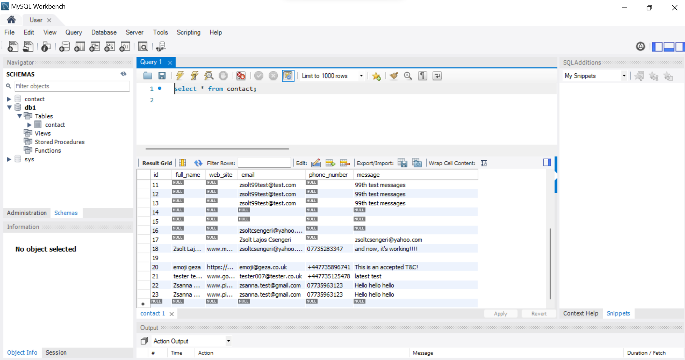

#Zsolt Csengeri's Portfolio and Contact Website

This project is a personal portfolio website developed by Zsolt Csengeri. It's aimed at showcasing my skills, experience, and providing my contact information. This platform offers an interactive way for potential clients or employers to get to know more about my work and get in touch.

##Live Demo
Visit the live demo of the website at https://zsoltcsengeri.github.io/PK-Work/.

##Motivation
The primary motivation for this project was to have a central hub where I could direct individuals interested in my work. It offers a detailed view of my skills, experience, and provides a form for quick and easy communication.

##Technologies
This project is created with:

HTML5
CSS3
Node.js
MySQL
Features
The website includes the following features:

A Contact Form where visitors can submit their details. These details (full name, phone number, email, website, and the text message) are stored in a MySQL database for future reference.
An **Updated CV** available to read and download by clicking on the CV button.
A **Terms and Conditions** page that users must agree to by ticking a checkbox before they can submit their details.
##Getting Started
Clone the repository to your local machine, then follow the instructions below.

##Prerequisites
To run this project, you'll need Node.js installed on your computer. You can download it from [here](https://nodejs.org/en).

You'll also need a MySQL server running.

##Installation
After installing the prerequisites, navigate to the project directory and run the following command to install the required dependencies:

`npm install`

##Usage
To start the server, run the following command in the terminal:

`node server.js`

Now, you can visit **localhost:3000** in your browser to view the website.

##Database Access
The submitted details are stored in a MySQL database, which allows for organized storage and easy retrieval of the contact details. For the purpose of demonstration and learning, you can access the database using the following credentials:

`username: user`
`password: PKuser`

Please note that this database contains only dummy data for testing and demonstration purposes. It's always recommended to secure your database credentials and not expose them publicly in a real-world project scenario.

##License
This project is open source and available under the [MIT License](docs/LICENSE).
